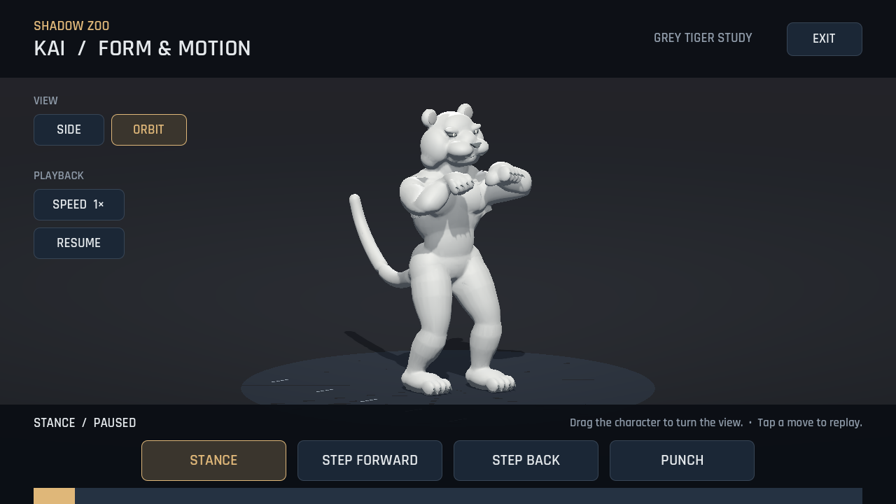
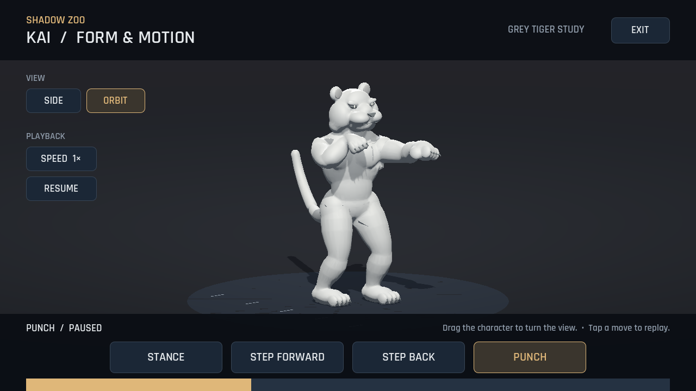
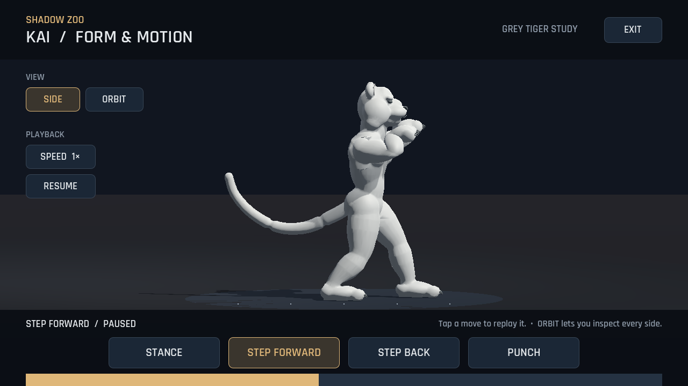

# Shadow Zoo 0.3 — เสือสามมิติสีเทา

รอบนี้เป็นต้นแบบโมเดลเสือ 3D สำหรับตรวจรูปร่างและการเคลื่อนไหว มีผิวร่างกายต่อเนื่อง โครงกระดูก และน้ำหนักผิวที่ข้อต่อ พร้อมท่ายืนการ์ด ก้าวหน้า ก้าวถอย และหมัดหนึ่งท่า

**[ดาวน์โหลด APK 0.3](../downloads/shadow-zoo-0.3.0.apk?raw=true)** · **[ดูหรือดาวน์โหลดคลิปจาก Godot](../downloads/tiger-3d-demo.mp4?raw=true)**

เปิด Shadow Zoo แล้วแตะ **3D MOTION STUDY** ในหน้าแรก

- เลือก **STANCE**, **STEP FORWARD**, **STEP BACK** หรือ **PUNCH** เพื่อเล่นท่านั้น
- เลือก **SIDE** เพื่อดูกล้องด้านข้าง หรือ **ORBIT** แล้วลากนิ้วบนตัวละครเพื่อหมุนตรวจรอบตัว
- ใช้ **SPEED** ดูแบบช้า และ **PAUSE / RESUME / REPLAY** หยุด ดูต่อ หรือเล่นซ้ำ
- **EXIT** หรือปุ่มย้อนกลับของ Android กลับไปหน้าแรก

ท่าก้าวและหมัดเล่นหนึ่งครั้งแล้วค้างท่าสุดท้ายสำหรับตรวจ การเลือกท่าหรือเล่นซ้ำจะเริ่มตัวอย่างใหม่ ท่ายืนเล่นวนได้ หน้านี้เป็นการศึกษาตัวละครสามมิติ ส่วนสนามต่อสู้ยังใช้เสือภาพวาดของ 0.2

## มุมตรวจตัวละคร



## ท่าหมัด



## ท่าก้าวจากกล้องด้านข้าง



ภาพและคลิปบันทึกจากฉาก Godot ที่อยู่ใน APK ไม่ใช่ภาพแนวคิด ตัวละครใช้เนื้อผิวสามมิติจริง อกและสะโพกหมุนได้ มุมกล้องเปลี่ยนให้เห็นด้านอื่นของโมเดลได้

## สิ่งที่ตรวจแล้ว

- ตัวเสือมีผิวร่างกายต่อเนื่อง 26,000 สามเหลี่ยม และกระดูก 26 ข้อ น้ำหนักผิวทุกจุดผ่านการตรวจค่ารวมและการเชื่อมกับโครงกระดูก
- คลิปทั้งสี่เริ่มที่เวลา 0 แก้ปัญหาเกมค้างข้อต่อจากท่าก่อนหน้าในช่วงเริ่มท่า
- ก้าวหน้าใช้เท้านำออกก่อน ก้าวถอยใช้เท้าหลังออกก่อน มีการเคลื่อนตัวไปกับการก้าว
- ในการสุ่มตรวจช่วงเท้ารับน้ำหนักของ Godot จุดกระดูกข้อเท้าคลาดในแนวพื้นมากที่สุดประมาณ 1.02 มิลลิเมตร การตรวจนี้วัดจุดข้อต่อในฉากทดสอบ ไม่ได้วัดการเล่นบน MatePad
- ผ่านการทดสอบโมเดลและหน้าดูท่า 50 ข้อ ระบบต่อสู้เดิม 25 ข้อ และเสือภาพวาด 56 ข้อ รวม 131 ข้อ รวมถึงการป้องกัน Android ปิดแอปอัตโนมัติก่อนกลับจากหน้าดูโมเดล

โมเดลยังเป็นงานสีเทาระยะแรก ต้องปรับผิวบริเวณไหล่ ใต้แขน และสะโพกที่มีรอยบีบหรือเหลี่ยมเล็กน้อย เพิ่มรายละเอียดหัว สัดส่วน ขน เกราะ และปรับน้ำหนักการเคลื่อนไหวต่อไป ก่อนนำเข้าใช้งานในสนามต่อสู้ งานรอบนี้ไม่ได้รับรองคุณภาพ AAA หรือ FPS บน MatePad

คลิปยาวประมาณ 8 วินาที ขนาดภาพ 1280×720 ใช้ไทม์ไลน์บันทึก 60 เฟรมต่อวินาที จึงไม่ได้เป็นผลวัดความเร็วการเรนเดอร์ของแท็บเล็ต

## ไฟล์โมเดลและต้นฉบับ

- [ดาวน์โหลดโมเดล GLB พร้อมแอนิเมชัน](../assets/fighters/tiger3d/tiger-study.glb?raw=true)
- [ดาวน์โหลดต้นฉบับ Blender](../downloads/tiger-study.blend?raw=true)
- [ข้อมูลช่วงเท้าสัมผัสพื้นและเวลาท่าทาง](../assets/fighters/tiger3d/tiger-study.motion.json)

โมเดลและท่าทางสร้างขึ้นสำหรับ Shadow Zoo ไม่มีไฟล์ตัวละครจากเกมอ้างอิง ต้นฉบับ Blender ใช้การดึงผิวแบบเดียวกับ glTF/Godot และเปิดบนท่ายืนการ์ด โดยเลือก NLA track ของท่าที่ต้องการเพื่อแก้ไขได้

สร้างไฟล์ซ้ำในคลาวด์ด้วย Blender 4.3.2:

```sh
blender -b --factory-startup --python tools/build_tiger_model.py -- \
  --blend-path /workspace/artifacts/tiger-study.blend
godot --headless --editor --import --path . --quit
godot --headless --path . --script tests/model_smoke.gd
```

งานสร้างรูปร่างอยู่ใน `tools/tiger_mesh.py` งานกระดูก น้ำหนักผิว และคีย์ท่าอยู่ใน `tools/tiger_rig.py` การเล่นและกล้องใน Godot อยู่ใน `scripts/model_study.gd` ซอร์สเครื่องมือและไฟล์สำหรับส่งดาวน์โหลดถูกแยกออกจาก APK
