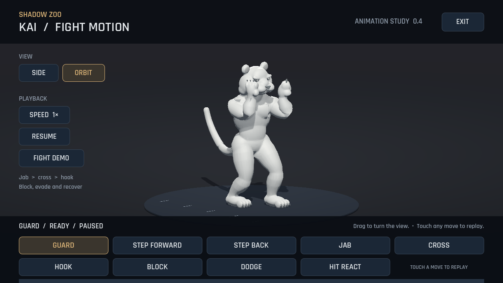
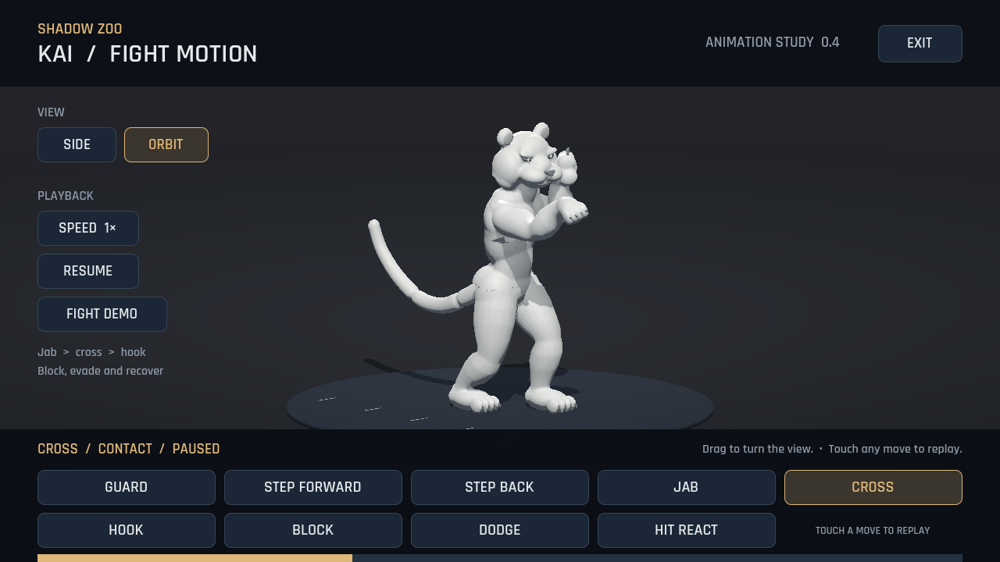
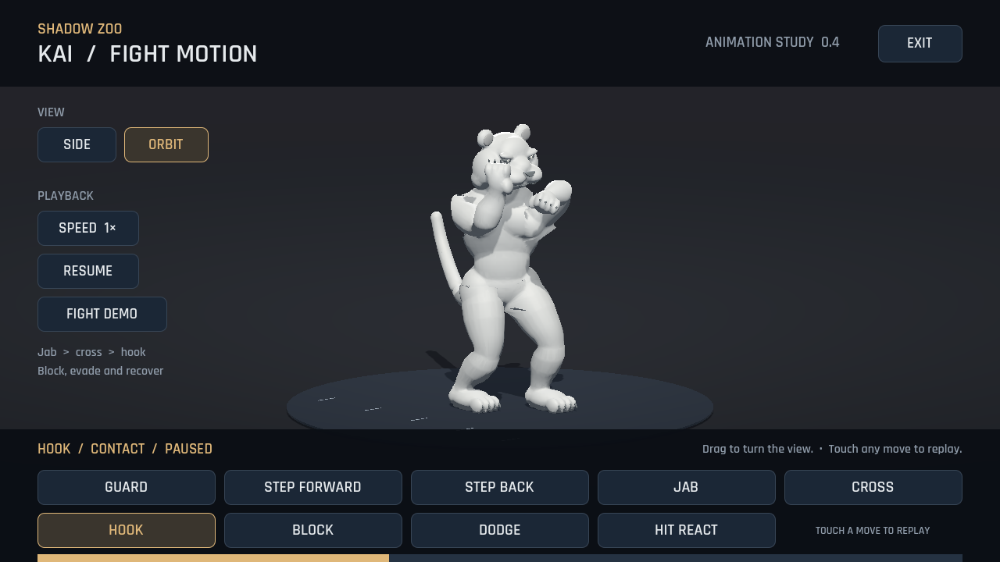
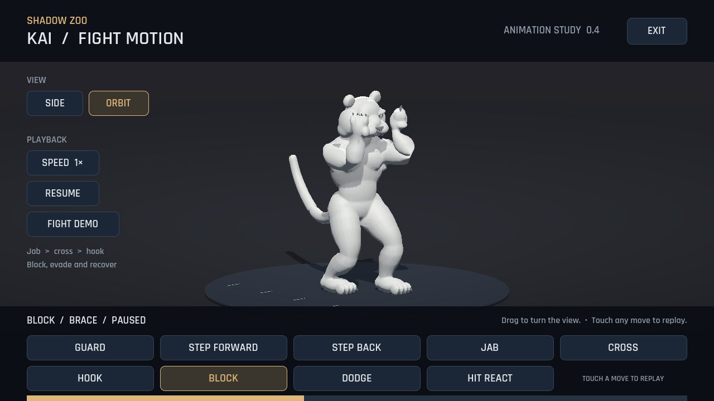
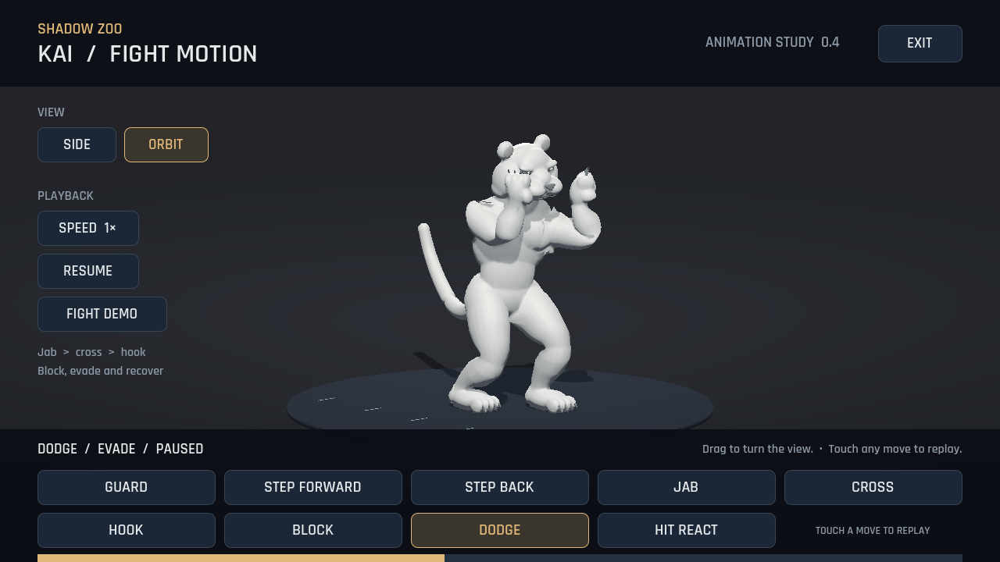

# Shadow Zoo 0.4 — ท่าต่อสู้ของเสือสามมิติ

ปรับเสือสีเทาให้มีท่าการ์ดสำหรับต่อสู้ เพิ่มหมัดและท่าป้องกัน รวม 9 ท่า ใช้โมเดลสามมิติและกระดูกเดิม พร้อมการเคลื่อนไหวที่สร้างสำหรับโปรเจกต์นี้

**[ดาวน์โหลด APK 0.4](../downloads/shadow-zoo-0.4.0.apk?raw=true)** · **[ดูหรือดาวน์โหลดคลิปจาก Godot](../downloads/tiger-fight-demo.mp4?raw=true)**

เปิด Shadow Zoo แล้วแตะ **3D MOTION STUDY** ในหน้าแรก จากนั้นแตะ **FIGHT DEMO** เพื่อดูท่าต่อเนื่อง หรือเลือกท่าแต่ละปุ่ม

| ปุ่ม | สิ่งที่เปลี่ยน |
| --- | --- |
| GUARD | ย่อเข่า วางเท้าเหลื่อม บิดไหล่ เก็บคาง มือหลังป้องกันหน้า มือหน้าเตรียมโจมตี |
| STEP FORWARD / STEP BACK | ก้าวสั้นแบบรักษาการ์ด เท้านำก้าวก่อนเมื่อเข้า เท้าหลังก้าวก่อนเมื่อถอย |
| JAB | แย็บมือหน้า ออกเร็วและดึงมือกลับ |
| CROSS | หมัดตรงมือหลัง ใช้สะโพกและอกหมุนส่งแรง มือหน้าป้องกันหน้า |
| HOOK | หมัดฮุกโค้งผ่านด้านข้าง ข้อศอกยังงอ ต่างจากหมัดตรง |
| BLOCK | ยกแขนปิดศีรษะและยุบตัวรับแรง ก่อนคืนการ์ด |
| DODGE | ย่อและเอียงหลบแนวหมัด โดยมือยังอยู่ใกล้หน้า |
| HIT REACT | ศีรษะและอกถอยจากแรงปะทะ แล้วกลับพร้อมสู้ |

ท่าการ์ดมีการหายใจ ขยับมือ ศีรษะ และหางด้วยจังหวะที่ต่างกัน หมัดแยกช่วงเตรียม ออก ปะทะ และคืนมือ มีจังหวะหมุนสะโพกก่อนอก แต่ละท่าจบที่การ์ดเดียวกันเพื่อเชื่อมต่อได้ หน้าดูท่าแสดง **CONTACT** ใกล้จังหวะหมัดถึงเป้าสมมติ

- **SIDE** ดูด้านข้าง หรือ **ORBIT** แล้วลากนิ้วบนตัวละครเพื่อหมุนตรวจรอบตัว
- **SPEED** ดูช้า, **PAUSE / RESUME / REPLAY** หยุด ดูต่อ หรือเล่นซ้ำ
- **FIGHT DEMO** เล่นแย็บ → หมัดตรงหลัง → ฮุก → บล็อก → หลบ → โดนตี → การ์ด แล้ววนซ้ำ แตะท่าเองเพื่อออกจากเดโม
- **EXIT** หรือปุ่มย้อนกลับของ Android กลับหน้าแรก

## การ์ดใหม่



## หมัดตรงหลังและฮุก





## บล็อกและหลบ





ภาพและคลิปบันทึกจากฉาก Godot ที่อยู่ใน APK ทุกท่าใช้ผิวสามมิติที่ดึงด้วยกระดูกจริง ดูแหล่งตัวอย่างเกมและสิ่งที่นำมาศึกษาได้ใน [บันทึกอ้างอิงท่าต่อสู้](fighting-animation-references.md)

## การตรวจและขอบเขตงาน

ตัวเสือยังใช้ร่างกายต่อเนื่อง 26,000 สามเหลี่ยม กระดูก 26 ข้อ และน้ำหนักผิวไม่เกิน 4 กระดูกต่อจุด คลิปทั้งหมดมีคีย์เริ่มต้นที่เวลา 0 และหมัด/ท่าป้องกันคืนการ์ดเดียวกัน

ผ่านการทดสอบโมเดลและหน้าดูท่า 139 ข้อ ระบบต่อสู้เดิม 25 ข้อ และเสือภาพวาด 56 ข้อ รวม 220 ข้อ ตรวจทั้งคีย์เริ่มต้น/ความยาวคลิปที่นำเข้า การคืนการ์ดและรอยต่อ idle ทั้งตำแหน่งกับการหมุน รูปท่าที่ต่างกัน เท้ารับน้ำหนัก ปุ่มสัมผัส เดโม การหยุด/ดูช้า และการกลับด้วยปุ่ม Android

ในการสุ่มตรวจช่วงเท้ารับน้ำหนักใน Godot จุดกระดูกข้อเท้าเลื่อนในแนวพื้นมากที่สุด 2.41 มิลลิเมตร การตรวจนี้วัดข้อต่อในฉากคลาวด์ ไม่ได้วัด FPS หรือยืนยันความเป็นธรรมชาติทุกเฟรม

APK ลงนามด้วยกุญแจทดสอบเดิม เลขเวอร์ชัน 4 ตรวจลายเซ็น v2/v3 และการจัดแนว 16 KB ผ่าน จึงรองรับอัปเดตทับรุ่นก่อนบน Android ที่รองรับแพ็กเกจนี้

คลิปยาวประมาณ 15 วินาที ขนาดภาพ 1280×720 บันทึกด้วยไทม์ไลน์ 60 เฟรมต่อวินาทีในคลาวด์ การบันทึกนี้ไม่ได้วัด FPS บน MatePad

รอบนี้ปรับแอนิเมชันในหน้าทดลองโมเดล สนามต่อสู้ยังใช้เสือภาพวาดของ 0.2 จังหวะ CONTACT ในหน้านี้ยังไม่ผูกกับความเสียหายของคู่ต่อสู้ ต้องตรวจและปรับความรู้สึกของท่าบนแท็บเล็ตต่อ ก่อนนำโมเดลเข้าสนามจริง ผิวใต้แขนและสะโพกยังมีรอยบีบจากโมเดลต้นแบบ โดยเฉพาะเมื่อพับแขนมาก

## ไฟล์โมเดลและต้นฉบับ

- [โมเดล GLB พร้อมแอนิเมชัน 9 ท่า](../assets/fighters/tiger3d/tiger-study.glb?raw=true)
- [ต้นฉบับ Blender](../downloads/tiger-study.blend?raw=true)
- [ช่วงเท้าสัมผัสพื้น จังหวะท่า และเหตุการณ์ของแอนิเมชัน](../assets/fighters/tiger3d/tiger-study.motion.json)

ไม่มีไฟล์ตัวละครหรือแอนิเมชันจากเกมอ้างอิงอยู่ในเกมนี้ ต้นฉบับ Blender ใช้การดึงผิวแบบเดียวกับ glTF/Godot และเปิดบนท่าการ์ด เลือก NLA track ของท่าที่ต้องการเพื่อแก้ไขได้

สร้างซ้ำในคลาวด์ด้วย Blender 4.3.2:

```sh
blender -b --factory-startup --python tools/build_tiger_model.py -- \
  --blend-path /workspace/artifacts/tiger-study.blend
godot --headless --editor --import --path . --quit
godot --headless --path . --script tests/model_smoke.gd
```

รูปร่างอยู่ใน `tools/tiger_mesh.py` กระดูก น้ำหนักผิว และคีย์ท่าอยู่ใน `tools/tiger_rig.py` หน้าทดลองและกล้องอยู่ใน `scripts/model_study.gd` ซอร์สเครื่องมือและไฟล์ดาวน์โหลดแยกออกจาก APK
