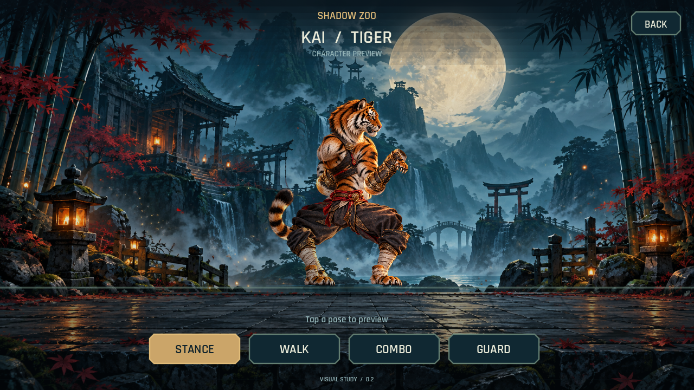
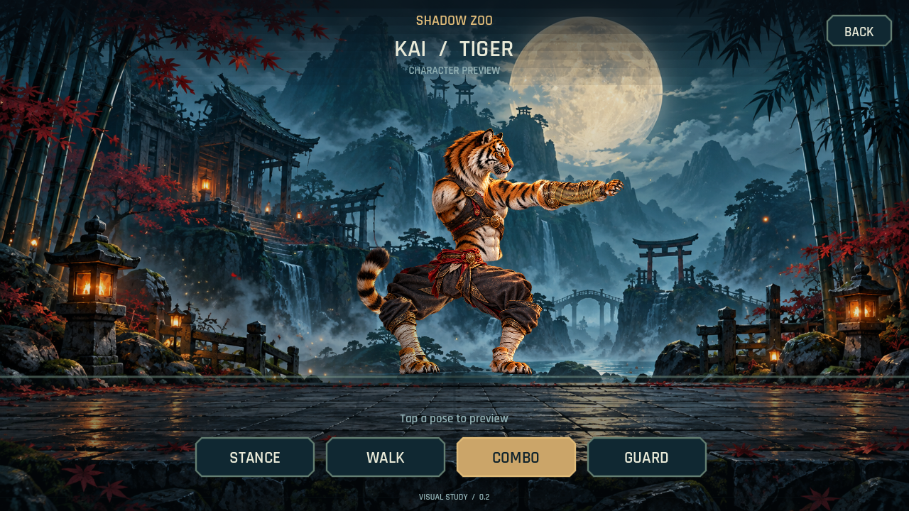
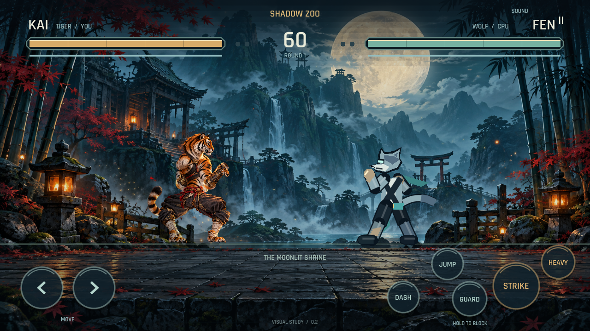

# Shadow Zoo 0.2 — ภาพจากเกมจริง

Kai เปลี่ยนเป็นเสือภาพละเอียด มีขน ลายเสือ เกราะแขน และเสื้อผ้า ภาพโปร่งใส 16 ชิ้นขยับด้วยโครงตัวละครใน Godot และใช้ตัวละครเดียวกันทั้งหน้าดูท่าและการต่อสู้

**[ดาวน์โหลด APK 0.2](../downloads/shadow-zoo-0.2.0.apk?raw=true)** · **[ดูหรือดาวน์โหลดคลิปการเคลื่อนไหว](../downloads/tiger-demo.mp4?raw=true)**

เปิด Shadow Zoo แล้วแตะ **PREVIEW KAI** จากหน้าแรก เลือก **STANCE**, **WALK**, **COMBO** หรือ **GUARD** เพื่อดูท่า แตะ **BACK** เพื่อกลับไปเริ่มต่อสู้ได้

## ท่ายืน

## คอมโบ

## ในสนามต่อสู้

ภาพทั้งหมดและคลิปบันทึกจากตัวเกม Godot บนเครื่องพัฒนา คลิปยาว 4.2 วินาที ใช้ไทม์ไลน์บันทึก 60 เฟรมต่อวินาที จึงไม่ได้แสดงผลการวัด FPS บน MatePad

ผ่านการตรวจระบบเกม 25 ข้อและงานภาพ 56 ข้อ APK ผ่านการตรวจลายเซ็น v2/v3 การจัดแนว 16 KB และการตรวจว่าภาพเสือกับข้อมูลโครงภาพอยู่ในไฟล์ติดตั้ง ใช้กุญแจเดียวกับ 0.1 พร้อมเลขเวอร์ชันที่เพิ่มขึ้น

ขั้นนี้เน้นรูปลักษณ์และการขยับของเสือ หมาป่ายังใช้ภาพเดิม แอนิเมชันยังเป็นต้นแบบที่ต้องปรับน้ำหนัก จังหวะ และเพิ่มภาพเฉพาะท่า ก่อนจะถึงคุณภาพของภาพเป้าหมาย การทดสอบความลื่นและการสัมผัสของเวอร์ชันนี้บน MatePad ยังรอการทดลองบนเครื่องจริง
